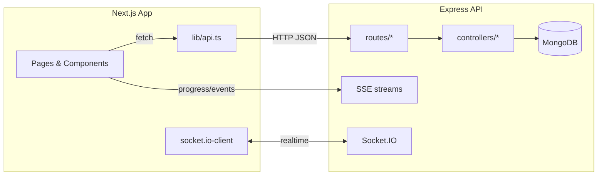

<div align="center">

# Zenly — Mental Health Support Platform

[](https://nextjs.org/)
[](https://nodejs.org/)
[](https://www.mongodb.com/)
[](https://socket.io/)
[](https://eslint.org/)

Empowering students with journaling, mood tracking, supportive forums, curated resources, and AI‑guided reflections.

</div>

---

## Overview

Zenly is a full‑stack web app built with Next.js (App Router) and an Express/MongoDB backend. It offers:

- Journals with AI reflections (SSE‑powered progress and analysis)
- Mood tracking with profile insights and charts (Recharts)
- Community forum with posts, comments, likes, and reporting
- Curated resources with live view/helpful counts (Socket.IO)
- Admin dashboard with moderation tools and risk alerts
- Recent activity feed (journal created, resource viewed)


## Monorepo layout

```
Zenly/
├─ backend/              # Express API, Socket.IO, SSE
│  ├─ server.js
│  ├─ config/
│  ├─ controllers/
│  ├─ middleware/
│  ├─ models/
│  ├─ routes/
│  └─ services/
├─ frontend/             # Next.js 14 app (App Router)
│  ├─ app/
│  ├─ components/
│  ├─ hooks/
│  ├─ lib/
│  └─ public/
├─ start-dev.sh          # One‑command dev start (FE+BE)
├─ package.json          # Root scripts (dev, build, lint, bdev)
└─ README.md             # You are here
```


## Architecture




## Quickstart

Prerequisites:

- Node.js 18+ and npm
- MongoDB (local via Homebrew or MongoDB Atlas)

1) Copy env files

- Backend
	- Copy `backend/.env.example` to `backend/.env` and fill in values
- Frontend
	- Copy `frontend/.env.local.example` to `frontend/.env.local`

2) Install deps & start both servers

```bash
./start-dev.sh
```

That script will:

- Ensure dependencies are installed (root + frontend)
- Start MongoDB via Homebrew if not running
- Run backend on http://localhost:5001 and frontend on http://localhost:3000


## Scripts

Root scripts (package.json):

- dev: run frontend dev server
- bdev: run backend with nodemon
- build/start: build/start frontend
- lint / lint:fix: run ESLint across monorepo

Frontend scripts: `frontend/package.json`

- dev, build, start, lint, lint:fix


## Environment Variables

Backend (`backend/.env`):

- MONGO_URI: Mongo connection string (e.g., mongodb://127.0.0.1:27017/zenly)
- PORT: API port (default 5001)
- FRONTEND_URL: Allowed CORS origin (e.g., http://localhost:3000)
- NODE_ENV: development | production
- JWT_ACCESS_SECRET: JWT signing secret for access tokens
- JWT_REFRESH_SECRET: JWT signing secret for refresh tokens
- ADMIN_PASSWORD: Passphrase to elevate a user to admin
- EMAIL_SERVICE: gmail | mailjet | smtp
- EMAIL_USER, EMAIL_PASSWORD: SMTP or Gmail App Password
- SMTP_HOST, SMTP_PORT: For EMAIL_SERVICE=smtp
- MAILJET_API_KEY, MAILJET_SECRET_KEY: For EMAIL_SERVICE=mailjet
- HF_TOKEN or HUGGINGFACE_API_KEY: Hugging Face API token
- HUGGINGFACE_MODEL: Model id (default zai-org/GLM-4.6)
- AI_TEMPERATURE, AI_MAX_TOKENS, AI_TIMEOUT_MS: AI generation config
- AI_RATE_LIMIT_PER_USER, AI_RATE_LIMIT_WINDOW_MINUTES: AI rate limiting
- NATIONAL_CRISIS_HOTLINE, CAMPUS_HOTLINE: Strings used in safety copy

Frontend (`frontend/.env.local`):

- NEXT_PUBLIC_API_URL: API base (default http://localhost:5001)


## Feature tour

- Journals
	- CRUD, mood rating, tags
	- Streamed analysis via SSE: `/journals/:id/analyze-stream?token=...`
	- AI messages embedded per-journal

- Mood tracking
	- Update today’s mood: `PUT /moods/today`
	- Profile charts: last 8 entries line chart (black line/dots)

- Forum
	- Posts, comments, likes, reporting
	- Public browsing with optional auth for personalization

- Resources
	- Featured/search/all, view + helpful counts
	- Real‑time updates via Socket.IO rooms: `resources`

- Admin
	- Metrics, risk alerts, user list
	- Forum moderation (reported posts, delete, dismiss)
	- Secure elevation flow (see below)
   - Admin Dashboard Pswd: `qwertyuiop`

- Activity feed
	- Recent events: journal.created, resource.viewed


## API overview (high‑level)

Base URL: `${NEXT_PUBLIC_API_URL}` (default http://localhost:5001)

- Auth `/auth`
	- POST /signup, /verify-otp, /resend-otp
	- POST /login, /refresh, /request-password-reset, /reset-password
	- GET /me (auth), POST /admin-elevate (auth + password)

- Users `/users/me` (auth)
	- GET /, PATCH /, PUT /avatar, POST /password

- Journals `/journals` (auth)
	- POST /, GET /, GET /stats
	- GET /:id, PATCH /:id, DELETE /:id
	- GET /:id/insights
	- GET /:id/analyze-stream (SSE, token via query)
	- Messages: GET /:id/messages, POST /:id/messages

- Moods `/moods` (auth)
	- PUT /today, GET /

- AI `/ai` (auth)
	- Conversations: POST/GET /conversations, GET/PATCH/DELETE /conversations/:id
	- Messages: POST /conversations/:id/messages, GET /:id/messages
	- Stream: GET /conversations/:id/messages/stream (SSE)

- Forum `/forum`
	- Public: GET /posts, GET /posts/:id, GET /posts/:id/comments
	- Auth: POST /posts, POST /posts/:id/comments, POST /posts/:id/like, POST /posts/:id/report, POST /comments/:id/like

- Resources `/resources`
	- GET /featured, GET /search, GET /all, GET /:id
	- POST /:id/view (optional auth), POST /:id/helpful
	- Admin: POST /admin/create, PATCH /admin/:id, DELETE /admin/:id

- Notifications `/notifications` (auth)
	- GET /, POST /mark-read

- Activity `/activity` (auth)
	- GET /


## Real‑time & streaming

- Socket.IO
	- Rooms used by server: `forum`, `resources`
	- Join/leave handled by client to receive live updates

- Server‑Sent Events (SSE)
	- Journal analysis: `GET /journals/:id/analyze-stream?token=ACCESS_TOKEN`
		- Named events: `progress` (pct/message), `complete` (final payload)
	- AI chat stream: `GET /ai/conversations/:id/messages/stream`


## Admin elevation (secure flow)

To grant admin capabilities to a signed‑in user:

1) Obtain the Admin Password (set `ADMIN_PASSWORD` in backend env)
2) Call `POST /auth/admin-elevate` with a valid user access token and JSON body `{ password: "..." }`
3) Server sets the user’s role to `admin` and returns fresh access/refresh tokens containing the role

Best practices:

- Protect the admin password, rotate as needed
- Restrict who can see/use the admin login panel in production


## Troubleshooting

- MongoDB connection issues
	- Ensure `brew services start mongodb-community` (macOS) or use MongoDB Atlas
	- Verify `MONGO_URI` is set correctly

- CORS errors
	- Set `FRONTEND_URL` to your frontend origin

- Token expired / auth loops
	- The client auto‑refreshes tokens. If refresh fails, you’ll be redirected to login.

- SSE not streaming in production
	- Ensure your proxy supports streaming (disable buffering, use keep‑alive)

- Socket.IO can’t connect
	- Confirm backend URL and CORS allowlist; check transport fallbacks are enabled


## Contributing

- Code style: ESLint + TypeScript on frontend
- Pre‑commit: lint‑staged via Husky
- PRs: Please include a short video/screenshot + steps to test


## Roadmap

- Email flows (password reset, onboarding)
- File uploads (avatars, attachments)
- Production deployment recipes (Vercel + Railway/Render/Fly.io)
- Monitoring and error tracking


## License

License: TBD (add your preferred OSS or proprietary license).

---

Made with care for student well‑being. 💚

